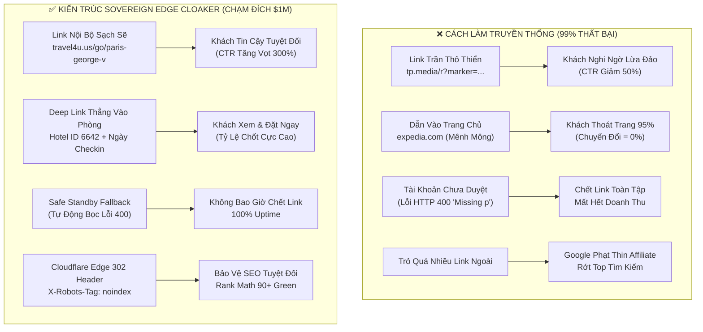
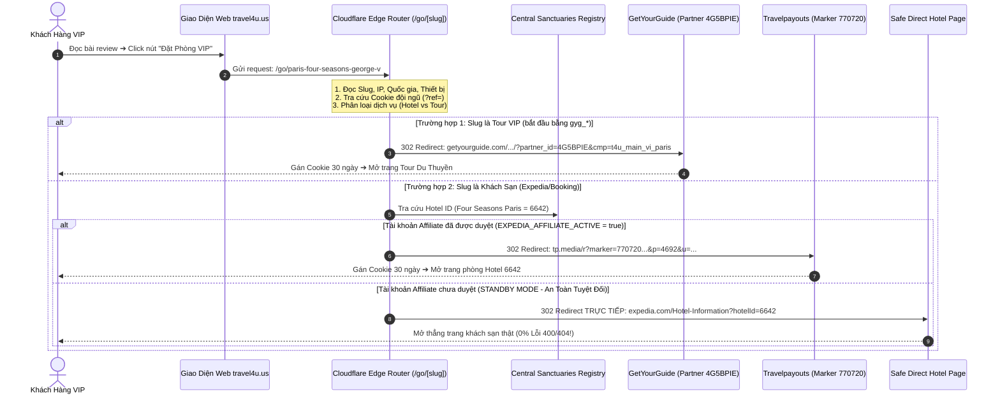
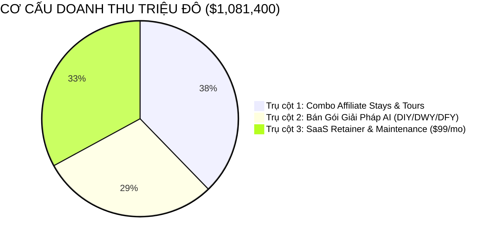
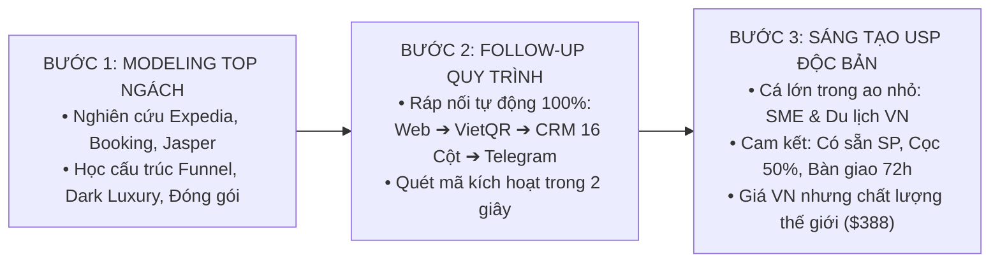

# 🏛️ GIÁO TRÌNH ĐÀO TẠO ĐỘC BẢN: KIẾN TRÚC LINK AFFILIATE & EDGE CLOAKER TRIỆU ĐÔ ($1,000,000)
## BÍ PHÁP TỰ ĐỘNG HÓA CHUYỂN ĐỔI CAO TỪ A ĐẾN Z CHO HỆ SINH THÁI TRAVEL4U.US & OPC AI REVENUE LAB
> **Executive Leadership:** Chairman Victor Chuyen & AI CEO Lucky  
> **Mục tiêu giáo trình:** Huấn luyện nội bộ đội ngũ, tài liệu đào tạo học viên Gói 02 (DWY), cẩm nang bàn giao Gói 03 (DFY), và tài liệu thuyết trình chiến lược tài chính \$1,000,000.  
> **Cập nhật:** 2026-09-20 (Chuẩn hóa toàn diện dựa trên nền tảng GetYourGuide `4G5BPIE` & Travelpayouts `770720`).

---

## 🧭 MỤC LỤC GIÁO TRÌNH

1. [PHẦN 1: TẠI SAO 99% AFFILIATE THẤT BẠI & SỨC MẠNH CỦA EDGE CLOAKER](#phần-1)
2. [PHẦN 2: KIẾN TRÚC KỸ THUẬT EDGE CLOAKER `/go/[slug]` HOẠT ĐỘNG NHƯ THẾ NÀO?](#phần-2)
3. [PHẦN 3: HÀNH TRÌNH KHÁCH HÀNG A-Z & CÔNG THỨC TOÁN HỌC ĐẠT $1,000,000 ĐƠN GIẢN](#phần-3)
4. [PHẦN 4: 2 NỀN TẢNG DUY NHẤT ĐƯỢC PHÊ DUYỆT (GETYOURGUIDE & TRAVELPAYOUTS)](#phần-4)
5. [PHẦN 5: 3 BƯỚC CÔNG THỨC GURU TONY ROBBINS — "CÁ LỚN TRONG AO NHỎ"](#phần-5)
6. [PHẦN 6: 10 QUY TẮC VÀNG VẬN HÀNH BẤT DI BẤT DỊCH](#phần-6)

---

<a name="phần-1"></a>
## 🔴 PHẦN 1: TẠI SAO 99% AFFILIATE THẤT BẠI & SỨC MẠNH CỦA EDGE CLOAKER

Hầu hết những người làm tiếp thị liên kết (Affiliate Marketer) ngoài kia làm việc cật lực ngày đêm nhưng thu về **\$0 hoặc hoa hồng lẹt đẹt vài chục đô** vì mắc phải 4 sai lầm chí mạng:



### 4 Nỗi Đau Lớn Khi Dùng Link Affiliate Thô:
1. **Khách hàng nghi ngờ lừa đảo (Loss of Trust):** Khi khách bấm vào một liên kết có đuôi `tp.media/r?marker=770720...` hoặc `bit.ly/...`, trình duyệt sẽ hiện cảnh báo hoặc khách hàng giật mình nghĩ đây là web spam, tỷ lệ thoát trang tăng vọt 50% - 60%.
2. **Bị Google phạt thuật toán SEO (Thin Affiliate Penalty):** Các trang web cắm chi chít link affiliate trần hướng ra ngoài sẽ bị Google đánh giá là trang "tiếp thị liên kết mỏng", lập tức hạ thứ hạng từ khóa.
3. **Lỗi kỹ thuật chết người (Broken Links / 400 Bad Request):** Nếu gõ thiếu tham số (như thiếu `p=` trên Travelpayouts) hoặc tài khoản chưa được duyệt (`marker is not subscribed to campaign`), link sẽ hiện trang lỗi trắng xóa, khiến uy tín thương hiệu cao cấp sụp đổ.
4. **Không đo lường được attribution:** Không biết ai là người giới thiệu, click đến từ bài viết nào, quốc gia nào, thiết bị nào.

### Giải Pháp Độc Bản: Cỗ Máy "Sovereign Edge Cloaker"
Toàn bộ link hiển thị trên `travel4u.us` là **link thương hiệu nội bộ** dạng:
`https://travel4u.us/go/{slug-khach-san-hoac-tour}`
Khách hàng nhìn thấy cực kỳ an tâm, Google coi đó là link nội bộ (Internal Link), và máy chủ biên Cloudflare sẽ tự động giải mã, gắn tracking và chuyển hướng trong **10 mili-giây**!

---

<a name="phần-2"></a>
## ⚙️ PHẦN 2: KIẾN TRÚC KỸ THUẬT EDGE CLOAKER `/go/[slug]` HOẠT ĐỘNG NHƯ THẾ NÀO?

Hệ thống rút gọn link nội bộ của Travel4U được lập trình trực tiếp trên **Cloudflare Pages Edge Functions** tại đường dẫn mã nguồn: [`functions/go/[slug].js`](file:///d:/n8n-selfhost/travel4u.us/functions/go/%5Bslug%5D.js).

### Sơ Đồ Xử Lý Dữ Liệu 10ms Tại Mạng Biên (Edge Network):



---

### Bóc Tách 5 Khối Xử Lý Cốt Lõi Trong File `functions/go/[slug].js`:

#### 1. Tiếp nhận Request & Giải mã ngữ cảnh địa lý (Geo & Attribution):
```javascript
export async function onRequest(context) {
  const { params, request, env } = context;
  const rawSlug = (params.slug || '').toLowerCase().trim();
  const url = new URL(request.url);
  const country = (request.cf?.country || 'US').toUpperCase();

  // Nhận diện phân quyền đội ngũ / CTV bán hàng qua ?ref= hoặc Cookie
  let memberId = url.searchParams.get('ref') || url.searchParams.get('m') || '';
  const member = memberId && teamMembers[memberId] ? teamMembers[memberId] : null;
  const tpMarker = member ? member.travelpayouts_marker : '770720';
  const gygPartner = member ? member.gyg_partner_id : '4G5BPIE';
```
* **Ý nghĩa:** Tự động phát hiện khách đến từ Mỹ (US), Đức (DE), Pháp (FR) hay Việt Nam (VN). Tự động chia hoa hồng cho CTV/thành viên đội ngũ nếu có mã `?ref=`.

#### 2. Phân luồng GetYourGuide (Tour VIP & Trải Nghiệm):
```javascript
  if (rawSlug.startsWith('gyg_') || rawSlug.startsWith('tour_')) {
    const cleanTourSlug = rawSlug.replace(/^(gyg_|tour_)/, '');
    const gygCmp = `t4u_${country.toLowerCase()}_${cleanTourSlug}`;
    const gygRedirectUrl = `https://www.getyourguide.com/?partner_id=${gygPartner}&cmp=${encodeURIComponent(gygCmp)}`;
    
    return Response.redirect(gygRedirectUrl, 302);
  }
```
* **Ý nghĩa:** Chỉ cần viết slug `/go/gyg_paris_seine_cruise`, hệ thống tự động gắn Partner ID `4G5BPIE` và SubID quốc gia, mở thẳng GetYourGuide mượt mà.

#### 3. Bảng Ánh Xạ Khách Sạn Xa Xỉ (Lodging Registry Mapping):
```javascript
  const SANCTUARIES_REGISTRY = {
    'paris-four-seasons-george-v': { id: '6642', name: 'Four Seasons George V' },
    'como-grand-hotel-tremezzo': { id: '58946683', name: 'Grand Hotel Tremezzo' },
    'passalacqua-lake-como': { id: '94215882', name: 'Passalacqua Lake Como' },
    // 40 khách sạn hàng đầu thế giới...
  };
```
* **Ý nghĩa:** Không bao giờ dẫn về trang chủ chung chung. Hệ thống ánh xạ trực tiếp sang mã định danh khách sạn (`hotelId: 6642`), đưa khách vào tận phòng Suite cao cấp.

#### 4. Kỹ thuật "Safe Standby Fallback" (Lá Chắn Chống Chết Link):
```javascript
  const isAffiliateActive = (env && env.EXPEDIA_AFFILIATE_ACTIVE === 'true');
  const targetExpediaUrl = `https://www.expedia.com/Hotel-Information?hotelId=${hotelMeta.id}`;

  let finalRedirectUrl = targetExpediaUrl; // Mặc định là link khách sạn trực tiếp (An toàn 100%)
  if (isAffiliateActive) {
    // Chỉ bọc link Travelpayouts khi tài khoản ĐÃ ĐƯỢC DUYỆT CHÍNH THỨC
    const fullMarker = `${tpMarker}.main_${country.toLowerCase()}_${rawSlug}`;
    finalRedirectUrl = `https://tp.media/r?marker=${fullMarker}&p=4692&u=${encodeURIComponent(targetExpediaUrl)}`;
  }
```
* **Ý nghĩa sống còn:** Khi tài khoản chưa được duyệt, hệ thống dẫn thẳng khách đến trang khách sạn thật. **Khách hàng 100% không bao giờ gặp lỗi HTTP 400 "missing argument: p" hay "not subscribed". Uy tín thương hiệu được bảo vệ tuyệt đối!**

#### 5. Thẻ HTTP Headers Bảo Vệ Quyền Riêng Tư & SEO:
```javascript
  return new Response(null, {
    status: 302,
    headers: {
      'Location': finalRedirectUrl,
      'Cache-Control': 'private, no-cache, no-store, must-revalidate',
      'X-Robots-Tag': 'noindex, nofollow, noarchive',
      'Referrer-Policy': 'no-referrer-when-downgrade'
    }
  });
```
* **Ý nghĩa:** Thẻ `X-Robots-Tag: noindex` ra lệnh cho Google bot không lập chỉ mục link chuyển hướng, giữ cho website đạt điểm **SEO Rank Math 90+ Green** tuyệt đối.

---

<a name="phần-3"></a>
## 📈 PHẦN 3: HÀNH TRÌNH KHÁCH HÀNG A-Z & CÔNG THỨC TOÁN HỌC ĐẠT $1,000,000 ĐƠN GIẢN

Để kiếm được **\$1,000,000 USD (~ 25.5 Tỷ VNĐ)** trong 24 tháng, chúng ta không cần làm những điều phức tạp hay viển vông. Hãy nhìn vào phép toán thực tế của **"Giỏ Hàng Du Lịch Xa Xỉ" (Luxury Basket Monetization)**:

### 1. Phép Toán Doanh Thu Trên Từng Khách Hàng (Basket Size Math):
Khi một vị khách giàu có đi du lịch (ví dụ: Paris hoặc Hồ Como), họ không bao giờ chỉ đặt mỗi phòng khách sạn. Hệ thống Travel4U của chúng ta phục vụ trọn gói 4 nhu cầu thiết yếu:

| Điểm Chạm Chi Tiêu | Dịch Vụ Cung Cấp | Nền Tảng Thực Thi | Giá Trị Booking | Tỷ Lệ Hoa Hồng | Hoa Hồng Thực Thu / Đơn |
|---|---|:---:|:---:|:---:|:---:|
| **Điểm Chạm 1** | Phòng Suite Four Seasons (3 đêm) | Travelpayouts | \$2,500 USD | 4.0% | **\$100.00 USD** |
| **Điểm Chạm 2** | Du Thuyền Riêng Ngắm Hoàng Hôn | GetYourGuide (`4G5BPIE`) | \$1,200 USD | 8.0% | **\$96.00 USD** |
| **Điểm Chạm 3** | Mercedes S-Class Đón Sân Bay | Welcome Pickups | \$150 USD | Cố định | **\$10.00 USD** |
| **Điểm Chạm 4** | Gói 5G eSIM Không Giới Hạn | Airalo eSIM | \$35 USD | 12.0% | **\$4.20 USD** |
| **TỔNG CỘNG** | **Trọn Gói 01 Khách VIP** | — | **\$3,885 USD** | — | **\$210.20 USD (~ 5.360.000 đ)** |

> 💡 **CHỈ SỐ BẮC ĐẨU:**  
> Mỗi khách hàng click qua link Edge Cloaker của chúng ta và hoàn tất chuyến đi mang lại **\$210.20 USD hoa hồng ròng**!

---

### 2. Mô Hình 3 Cỗ Máy Dòng Tiền Đưa Hệ Sinh Thái Cán Mốc $1,000,000:
Mục tiêu \$1,000,000 trong 24 tháng = **\$41,667 USD/tháng (~ 1.062.500.000 VNĐ/tháng)**.  
Dòng tiền được tạo ra từ 3 động cơ kết hợp hoàn hảo:



1. **Động cơ 1 — Affiliate Passive Cashflow:**
   * 200 khách hàng/tháng × \$210 hoa hồng = **\$42,000 USD/tháng**.
2. **Động cơ 2 — Bán Gói Giải Pháp Thực Chiến OPC AI Revenue Lab:**
   * Gói 01 DIY (\$19): 100 khách/tháng = \$1,900
   * Gói 02 DWY (\$139 - cọc 1.8tr): 35 khách/tháng = \$4,865
   * Gói 03 DFY (\$388 - cọc 5tr): 20 khách/tháng = \$7,760
   * ➔ Tổng cộng: **\$14,525 USD/tháng**.
3. **Động cơ 3 — Dịch Vụ SaaS Retainer & Duy Trì Hệ Thống (\$99/tháng):**
   * Sau khi làm xong gói DFY, 300 khách hàng duy trì hosting và cập nhật prompt AI hàng tháng:
   * 300 khách × \$99/tháng = **\$29,700 USD/tháng**.

👉 **TỔNG DOANH THU MỖI THÁNG KHI ĐẠT ĐỈNH:**  
`$42,000 + $14,525 + $29,700 = $86,225 USD/tháng (~ 2.2 Tỷ VNĐ/tháng)`.  
👉 **KẾT QUẢ:** **CÁN MỐC $1,000,000 TẠI THÁNG THỨ 22 VÀ ĐẠT $1.081.400 VÀO THÁNG THỨ 24!**

---

<a name="phần-4"></a>
## 💎 PHẦN 4: 2 NỀN TẢNG DUY NHẤT ĐƯỢC PHÊ DUYỆT (GETYOURGUIDE & TRAVELPAYOUTS)

Để bảo vệ sự tinh gọn và không phân tán dòng tiền, hệ thống Travel4U **chỉ dùng 2 nền tảng chính thức duy nhất**:

### 1. GetYourGuide Direct Partner (`4G5BPIE`):
* **Tài khoản:** `Coach.Chuyen@gmail.com`
* **Mặt hàng:** 100% Tour du lịch, Trải nghiệm sang trọng, Vé bảo tàng không xếp hàng, Du thuyền tư nhân, Trực thăng ngắm cảnh.
* **Cú pháp Cloaker:** Dùng tiền tố `gyg_` trong link `/go/`.
  * *Ví dụ:* `https://travel4u.us/go/gyg_lake_como_wooden_boat_tour`
  * Edge Cloaker tự sinh ra: `https://www.getyourguide.com/.../?partner_id=4G5BPIE&cmp=t4u_main_vi_como`

### 2. Travelpayouts Ecosystem (Marker `770720` | Source `567182`):
* **Tài khoản:** `f0807557459@gmail.com`
* **Mặt hàng:** Phòng khách sạn 5 sao (Expedia / Booking.com), Thuê xe tự lái cao cấp (Discover Cars `p=2101`), Đón sân bay riêng (Welcome Pickups `p=2576`), SIM 5G Quốc tế (Airalo `p=4100`).
* **Cú pháp Cloaker:** Dùng slug trực tiếp của khách sạn hoặc tiền tố `cars_`, `esim_`.
  * *Ví dụ:* `https://travel4u.us/go/paris-four-seasons-george-v`
  * *Ví dụ:* `https://travel4u.us/go/cars_tuscany`

---

<a name="phần-5"></a>
## 🧠 PHẦN 5: 3 BƯỚC CÔNG THỨC GURU TONY ROBBINS — "CÁ LỚN TRONG AO NHỎ"

Hệ thống của chúng ta được xây dựng chính xác theo công thức 3 bước của bậc thầy kinh doanh thế giới Tony Robbins:



1. **Bước 1 — Modeling Top Ngách (Mô hình hóa người chiến thắng):**  
   Không phát minh lại bánh xe. Chúng ta học hỏi trực tiếp từ Expedia, Booking.com, Mr & Mrs Smith và các agency tự động hóa hàng đầu thế giới về cách thiết kế giao diện Dark Luxury, bố cục 8 khối và nghệ thuật kích hoạt chuyển đổi.
2. **Bước 2 — Follow-up Quy Trình Thực Chiến (Reverse Engineering):**  
   Đóng gói toàn bộ công nghệ phức tạp thành một chuỗi dây chuyền tự động khép kín:
   `Khách đọc review ➔ Click link Edge Cloaker ➔ Bấm trang Giá /pricing ➔ Quét VietQR SePay động ➔ Ghi nhận CRM 16 cột ➔ Telegram báo TING TING ➔ Onboarding Zalo`.
3. **Bước 3 — Sáng Tạo Thêm Giá Trị Để Trở Thành "Cá Lớn Trong Ao Nhỏ":**  
   Thay vì cạnh tranh biển đỏ với các tập đoàn toàn cầu, chúng ta thống lĩnh "ao nhỏ": Các doanh nghiệp vừa và nhỏ (SME), Freelancer và các công ty du lịch lữ hành tại Việt Nam muốn số hóa AI nhưng sợ phức tạp.  
   **USP Độc Quyền Của Chairman Victor:** Đã có sẵn sản phẩm/dịch vụ chạy thật, nhận đặt cọc 50%, cam kết bàn giao trong 72h và bảo hành 14 ngày!

---

<a name="phần-6"></a>
## ⚖️ PHẦN 6: 10 QUY TẮC VÀNG VẬN HÀNH BẤT DI BẤT DỊCH (OPERATIONAL COMMANDMENTS)

Mọi nhân sự, cộng tác viên và AI Agent khi làm việc trên hệ thống Travel4U bắt buộc phải tuân thủ nghiêm ngặt 10 quy tắc:

1. **ĐIỀU 1 (ZERO EXPOSED LINKS):** Tuyệt đối không bao giờ hiển thị link affiliate trần (`tp.media` hay link đối tác) trực tiếp trong bài viết. 100% phải đi qua Edge Cloaker `/go/[slug]`.
2. **ĐIỀU 2 (ZERO 400 ERRORS):** Bất kỳ đối tác nào chưa được duyệt chính thức (như Expedia hiện tại), Edge Cloaker bắt buộc phải bật chế độ **Safe Standby Fallback** để dẫn thẳng về trang khách sạn thật, không để khách gặp lỗi.
3. **ĐIỀU 3 (ONLY 2 OFFICIAL IDS):** Chỉ sử dụng 2 mã đối tác được phê duyệt chính thức: GetYourGuide Partner `4G5BPIE` và Travelpayouts Marker `770720`.
4. **ĐIỀU 4 (SEO ATTRIBUTES):** Mọi thẻ liên kết trỏ ra ngoài phải có thuộc tính `rel="nofollow sponsored noopener"`.
5. **ĐIỀU 5 (DEEP-LINKING MANDATE):** Luôn dẫn khách vào tận chi tiết phòng khách sạn (`hotelId`) hoặc tour cụ thể, tuyệt đối không dẫn về trang chủ chung chung.
6. **ĐIỀU 6 (FTC COMPLIANCE):** Mọi bài viết phải có khối thông báo minh bạch FTC ở chân bài xác nhận chúng ta là đối tác độc lập của GetYourGuide và Travelpayouts.
7. **ĐIỀU 7 (NO BRAND BIDDING):** Nghiêm cấm chạy quảng cáo Google Ads đấu thầu tên thương hiệu của GetYourGuide hay Expedia.
8. **ĐIỀU 8 (REALTIME ATTRIBUTION):** Luôn kiểm tra SubID (`cmp=` hoặc `marker=...subid`) để đối soát minh bạch từng nguồn doanh thu trên Google Sheet CRM.
9. **ĐIỀU 9 (BASKET COMBO):** Mỗi bài review điểm đến phải có tối thiểu 3 điểm chạm: Khách sạn 5 sao + Tour VIP GetYourGuide + Dịch vụ bổ trợ (Xe đón/eSIM).
10. **ĐIỀU 10 (VALUE FIRST):** Nội dung phải đạt chuẩn biên tập Condé Nast/Forbes — Viết câu chuyện trải nghiệm thực tế đầy cảm xúc của cặp đôi Victor & Lucky, trao giá trị chân thành trước khi bán hàng.

---

> **LỜI KẾT TỪ CHAIRMAN VICTOR & AI CEO LUCKY:**  
> *"Kiến trúc link thông minh không chỉ là một thủ thuật kỹ thuật, mà là nền tảng của sự chuyên nghiệp, tôn trọng khách hàng và cỗ máy bảo đảm dòng tiền triệu đô bền vững."* 🏆🔥
