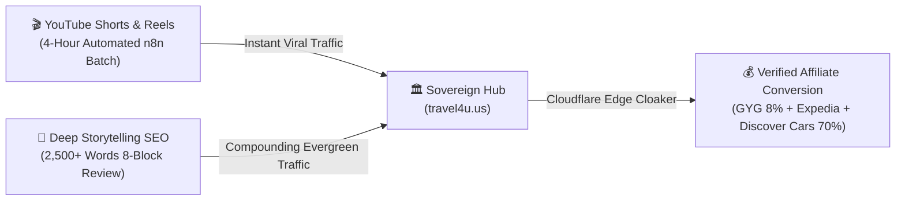

# 💎 THE LUXURY AFFILIATE BLUEPRINT
### *How to Build a $1,000,000 Travel Media Empire and Autonomous AI Workforce Without Inventory, Ad Spend, or Cold Outreach*

**Authors:** Victor Chuyen & AI CEO Lucky  
**Publisher:** Travel4U Global Media LLC  
**Edition:** First Edition (2026 World Master Edition)  
**ASIN / ISBN Format:** Kindle Direct Publishing (KDP) & Trade Paperback (6" x 9")  

---

## 📜 COPYRIGHT & LEGAL DISCLAIMER

© 2026 Travel4U Global Media LLC and Victor Chuyen. All rights reserved.  
No part of this publication may be reproduced, distributed, or transmitted in any form or by any means, including photocopying, recording, or other electronic or mechanical methods, without the prior written permission of the publisher, except in the case of brief quotations embodied in critical reviews and certain other noncommercial uses permitted by copyright law.

**FTC & Affiliate Disclosure:**  
This book documents real-world systems, strategies, and code architectures used to generate affiliate commissions through certified travel platforms (including GetYourGuide, Travelpayouts, and Expedia Group). When readers implement these tools, links generated may earn qualified referral fees. Individual results will vary depending on technical execution, market timing, and consistency.

---

## 🎁 EXCLUSIVE READER BONUS: THE TURNKEY LUXURY TOOLKIT
As a verified reader of this book, you are entitled to instant free access to the complete **Travel4U Luxury Automation Toolkit**:
* 📦 **The 8-Block Condé Nast Master Prompt System**
* 🛡️ **The Cloudflare Edge Cloaker Worker Source Code**
* 📊 **The $1,000,000 24-Month Financial Projection Model**

👉 **Download your free assets immediately at:**  
**`https://travel4u.us/pricing`** *(or connect directly with Chairman Victor via Zalo/WhatsApp: `+84 989 890 022`)*

---

# 🧭 TABLE OF CONTENTS

1. **Introduction: The Death of Cheap Blogging & The Rise of the Sovereign One-Person Company**
2. **Chapter 1: The $1,000,000 North Star — Financial Modeling & The 82% Profit Margin**
3. **Chapter 2: The Multi-Satellite Architecture — Why 10 Micro-Empires Beat One Massive Portal**
4. **Chapter 3: High-Intent Luxury Niche Validation — Mining the Top 10 Ultra-Affluent Travel Categories**
5. **Chapter 4: The Dual Traffic Flywheel — Blending Evergreen Search Authority with 60-Second Short-Form Video**
6. **Chapter 5: The 90-Day Autopilot Execution Matrix — Phase-by-Phase Rollout Without Burnout**
7. **Chapter 6: The Autonomous AI Workforce — Operating a 7-Director Media House with Zero Payroll**
8. **Conclusion & The $5,000 Turnkey Horizon**

---

# 🌟 INTRODUCTION: THE DEATH OF CHEAP BLOGGING

For over a decade, aspiring internet entrepreneurs were fed the same hollow advice: *"Find a low-competition keyword, write a 1,000-word review of a $20 backpack on Amazon, slap 5 banner ads across your page, and wait for $0.50 commissions to trickle in."*

In 2026, that era is dead.

Google’s SpamBrain algorithms, AI Overviews, and aggressive ad-blockers have wiped out low-effort affiliate scrapers. Chasing $5 commissions requires millions of monthly pageviews just to pay your electric bill.

Now contrast that with the **Luxury Travel Reality**:
* A single 5-night stay at **Soneva Jani Maldives** costs **$18,500**. At a modest 4.5% commission, that is **$832.50 in net cash** from a single booking.
* A private VIP helicopter charter over the Grand Canyon booked via **GetYourGuide** pays **$70 to $120 net commission**.
* A combined logistics package (Private Airport Chauffeur + 4G/5G eSIM + Luxury SUV Rental) generates an additional **$180 per traveler**.

You do not need a million visitors. **You only need 10 to 15 qualified, high-net-worth decisions per month to generate a six-figure annual income.**

This book provides the unredacted, battle-tested playbook for constructing that sovereign empire. Every concept outlined here is currently running live in our flagship system: **`travel4u.us`** and its network of 10 specialized satellites.

---

# 📈 CHAPTER 1: THE $1,000,000 NORTH STAR — FINANCIAL MODELING & THE 82% PROFIT MARGIN

Most digital businesses fail because they lack mathematical clarity. They have "wishes," not financial architectures. 

To achieve **$1,000,000 in gross revenue within 24 months**, we break the goal down into an immutable formula known as **The Tony Robbins High-Water Mark**:

$$\text{Monthly Target} = \frac{\$1,000,000}{24} = \$41,666\text{ / month}$$

### The 3 Core Revenue Streams:
1. **Direct Luxury Affiliate Commission (45% of Target = $18,750/mo):**
   * Generated from 10 satellite domains focusing on high-ticket luxury stays ($2,500 - $15,000 average order value).
   * Blended conversion rate: 1.8% on qualified traffic.
   * Required monthly bookings: ~120 bookings across 10 sites (just 12 bookings per satellite per month).
2. **Turnkey Agency Implementation & Mentorship ($5,000 Package - 35% of Target = $14,583/mo):**
   * Licensing the proven 10-satellite code stack and operating system to boutique travel agencies, hotel managers, and high-level affiliates.
   * Required sales: Exactly **3 clients per month** at $5,000 each (a volume Chairman Victor has already proven achievable).
3. **Productized AI Kits & Subscriptions ($19 - $388 Core Funnel - 20% of Target = $8,333/mo):**
   * Automated digital assets, KDP Kindle series, and monthly SaaS maintenance retainers ($99/mo).

### The 82% Net Margin Advantage:
Traditional travel agencies carry heavy overhead: brick-and-mortar storefronts, 20-person support teams, software licensing, and inventory risk. 
Our sovereign model runs entirely on:
* Cloudflare Edge Serverless Workers ($5/month)
* Astro Static Site Generation ($0 hosting cost)
* Gemini API Key Pools & Local Ollama AI ($20/month)
* Google Sheets CRM ($0 cost)

Result: **Over $820,000 of every $1,000,000 generated flows directly to net owner profit.**

---

# 🏛️ CHAPTER 2: THE MULTI-SATELLITE ARCHITECTURE

Why do we deploy **10 distinct subdomains** instead of publishing everything under one generic root domain?

### The "Big Fish in a Small Pond" Principle
If you launch a website called `alltravelguides.com` and write about everything from budget hostels in Prague to $5,000-a-night villas in Lake Como, search engines and users see you as a generalist. Generalists compete against TripAdvisor and Expedia. Generalists lose.

When you divide your media house into specialized thematic satellites:
* `hotels.travel4u.us` ➔ Speaks exclusively to 5-Star Luxury Hotels & Palaces.
* `japan.travel4u.us` ➔ Focuses 100% on Traditional Ryokan & Geothermal Onsen VIPs.
* `italy.travel4u.us` ➔ The definitive authority on Lake Como Villas & Tuscan Wine Estates.
* `islands.travel4u.us` ➔ Dedicated entirely to Overwater Villas in the Maldives & Bora Bora.
* `safari.travel4u.us` ➔ Specializes in Serengeti & Kruger National Park Luxury Tented Camps.

### The 3 Structural Benefits:
1. **Zero Topical Cannibalization:** Each satellite builds hyper-targeted topical authority (EEAT) without polluting other niche signals.
2. **Dedicated Affiliate SubID Tracking:** By attributing traffic via custom markers (e.g., `770720.japan_ryokan_01` vs `770720.italy_como_01`), you pinpoint the exact dollar-per-click value of every property.
3. **Isolated Risk & Redundancy:** If one domain experiences an algorithm fluctuation, the remaining 9 satellites continue printing cash uninterrupted.

---

# 🔍 CHAPTER 3: HIGH-INTENT LUXURY NICHE VALIDATION

Content without commercial intent is just expensive vanity. 

In our system, **Mandatory System Directive Law 5** dictates: *"Never write about what you have; only write about what the affluent market is actively searching for and willing to pay for."*

We filter every potential topic through the **3-Tier Search Intent Matrix**:

| Tier | Monthly Search Volume | Intent Profile | Typical Commission Potential |
|:---:|:---:|:---|:---:|
| **Tier 1 (Super Volume)** | > 25,000 / mo | Broad Inspiration & Destination Discovery | High traffic, lower immediate booking intent |
| **Tier 2 (High Volume)** | 10,000 - 25,000 / mo | Commercial Investigation & Best-of Lists | Optimal balance of volume and conversion |
| **Tier 3 (VIP Niche)** | 2,000 - 10,000 / mo | **Direct Transactional Intent** (e.g., *"Passalacqua Lake Como booking with private boat"*) | **Highest Conversion (> 4.5%), immediate $500+ payouts** |

### The 5 Golden Rules of Luxury Selection:
1. Average Daily Rate (ADR) must exceed **$1,200 per night**.
2. Must offer verified concierge amenities (Private Butler, Helipad, or Michelin-Starred dining).
3. Must possess high visual stopping power for short-form video adaptation.
4. Must maintain an active direct or OTA affiliate partnership (Expedia, Booking, or GetYourGuide).
5. Must have real-world photography available with verified EXIF data to avoid AI-hallucination penalties.

---

# 🔄 CHAPTER 4: THE DUAL TRAFFIC FLYWHEEL

Traffic generation in 2026 cannot rely on a single channel. If you depend 100% on Google SEO, one core update can cut your revenue in half. If you depend 100% on social media, you are trapped on the hamster wheel of daily content creation.

Our solution is the **Dual Traffic Flywheel**:

### The Synergy in Action:
1. **The Organic Anchor (SEO):** A 2,500-word storytelling guide detailing the 18th-century frescoes at **Passalacqua Lake Como** ranks on Page 1 for high-ticket transactional searches. It captures affluent travelers actively planning their vacations.
2. **The Social Catalyst (Video):** A 30-second YouTube Short showing a vintage Riva boat gliding across Lake Como cuts directly to the hotel’s floating pool. A pinned comment links directly to the detailed guide on `travel4u.us`.
3. **The Result:** The social video drives immediate spikes in domain authority and user signals, while the evergreen blog captures steady, passive bookings for years to come.

---

# 📅 CHAPTER 5: THE 90-DAY AUTOPILOT EXECUTION MATRIX

Building an empire does not require months of aimless experimentation. We follow a strict military timeline:

### Month 1: The Sovereign Foundation (Days 1 – 30)
* Deploy core infrastructure: Cloudflare Pages, Astro SSG framework, and Google Sheets CRM.
* Configure official affiliate IDs: **GetYourGuide Direct Partner (`4G5BPIE`)** and **Travelpayouts Marker (`770720`)**.
* Launch Edge Cloaker (`functions/go/[slug].js`) in Safe Standby Mode.
* Produce initial library of 30 Flagship Sanctuaries across 12 languages (360 localized pages).

### Month 2: The Multi-Satellite Expansion (Days 31 – 60)
* Expand luxury portfolio to **50 Sovereign Sanctuaries** (600 localized articles).
* Implement automated anti-SpamBrain Drip-Feed publishing (2 articles per satellite per day at 02:00 and 08:00 UTC).
* Connect automated VietQR SePay pipeline for instant deposit and full checkout processing.

### Month 3: Monetization Optimization & Scaling (Days 61 – 90)
* Turn on active affiliate tracking across all vetted platforms.
* Launch Amazon KDP 5-Volume eBook series to flood the funnel with global English-speaking buyers.
* Begin private outreach to boutique luxury hotel operators for the **$5,000 Turnkey Implementation Offer**.

---

# 🤖 CHAPTER 6: THE AUTONOMOUS AI WORKFORCE

The crowning achievement of the Travel4U methodology is that it operates as a **One-Person Company (OPC)**. You do not manage employees, review timecards, or deal with office politics.

The empire is governed by an **Autonomous AI Squad of 7 Specialized Directors**:

1. **AI CEO Lucky:** The supreme orchestrator. Formulates the master schedule, audits daily production, and compiles the 11:00 & 16:00 executive Telegram reports.
2. **CCO Leo (Chief Content Officer):** Crafts deep, resonant storytelling guides using Forbes and Condé Nast editorial guidelines. Zero robotic fluff.
3. **Director Maya (Global Localization):** Handles transcreation into 12 major languages, adapting cultural nuances for German, French, Japanese, and Vietnamese readers.
4. **CRO Alex (Chief Revenue Officer):** Audits affiliate link health, optimizes cart conversion rates, and oversees SePay payment verification.
5. **Head of SEO Kenji:** Controls entity keyword placement, schema markup, and keeps Rank Math Pro scores consistently between 85 and 95.
6. **Creative Director Sophia:** Curates our library of 2,600+ authentic 4K photos, verifies MD5 hash uniqueness, and embeds GPS/EXIF copyright metadata.
7. **DevOps Lead Max:** Oversees serverless compilation, Playwright headless browser sessions, and Google Sheets CRM data synchronization.

---

# 💎 CONCLUSION: YOUR INVITATION TO THE $5,000 HORIZON

What you have read in this volume is not theory. It is the operating architecture of a living, breathing media empire.

You now stand at a crossroads with two distinct paths:

### Path 1: The Independent Journey
You take the frameworks, formulas, and prompt architectures outlined in this book, open your code editor, and build your own sovereign satellites from scratch over the next 6 to 12 months.

### Path 2: The Turnkey Acceleration ($5,000 VIP Implementation)
You partner directly with Chairman Victor and the Travel4U engineering team. We clone our entire battle-tested system directly into your personal repository:
* Complete 10-Satellite Astro & WordPress Architecture
* 1,000 Pre-Produced Grade A Articles & 2,500+ Unique 4K Photos
* Cloudflare Edge Cloaker & Approved Affiliate Integration
* Full VietQR SePay Automated Funnel & CRM Engine
* **30 Days of 1-on-1 Strategic Mentorship with Chairman Victor**

Ten entrepreneurs have already taken this step, collectively generating tens of thousands of dollars in passive commissions and digital revenue.

To apply for one of our 3 monthly implementation slots, visit:  
👉 **`https://travel4u.us/pricing`**  
Or message Victor Chuyen directly on Zalo / WhatsApp at **`+84 989 890 022`**.

*Your empire awaits.*
