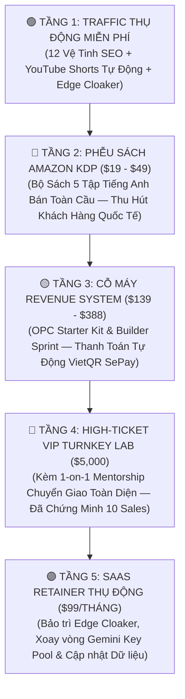

# 💎 GIÁO TRÌNH MASTER: ĐÓNG GÓI HỆ THỐNG TRAVEL4U THÀNH BỘ SÁCH AMAZON KDP VÀ KHÓA HUẤN LUYỆN HIGH-TICKET $5,000
> **Executive Leadership:** Chairman Victor & AI CEO Lucky  
> **Kế thừa thành tích thực chiến:** Kênh bán Ebook/Dịch vụ Affiliate Travel đạt **10 Sales × $5,000 = $50,000** của Chairman Victor  
> **Cập nhật hệ thống:** Phiên bản Triển khai 2026 — Master Blueprint A-Z  

---

## 🧭 TỔNG QUAN CHIẾN LƯỢC: MÔ HÌNH BÁNH ĐÀ TRI THỨC VÀ DÒNG TIỀN KÉP

Hệ thống **TRAVEL4U** không chỉ là một cỗ máy sản xuất nội dung và tiếp thị liên kết tự động, mà còn là một **Tài sản Trí tuệ (Intellectual Property - IP) đỉnh cao**. Việc sở hữu hơn 35+ tài liệu quy chuẩn kỹ thuật (Markdown `.md`), 12 vệ tinh, cỗ máy Edge Cloaker và Funnel All-in-One CRM cho phép chúng ta kích hoạt **Mô hình Giá trị 4 Tầng (The 4-Tier Value Ladder)**:



---

## 📚 BẢN ĐỒ KIỂM TOÁN & ĐỐI CHIẾU 35+ FILE MARKDOWN THÀNH BỘ SÁCH KDP 5 TẬP

Toàn bộ kho tàng 35+ file `.md` trong hệ sinh thái của chúng ta được chia thành **5 Tập Sách Amazon KDP độc lập** (đồng thời là 5 Module nòng cốt trong Gói Huấn Luyện $5,000):

```
========================================================================================
BỘ SÁCH: "THE MILLION-DOLLAR TRAVEL AFFILIATE EMPIRE & AUTONOMOUS AI WORKFORCE"
Tác giả: Victor Chuyen & AI CEO Lucky | Bản quyền: Travel4U Global Media LLC
========================================================================================
```

---

### 📖 TẬP 1: BẢN ĐỒ CHIẾN LƯỢC TRIỆU ĐÔ & NGHIÊN CỨU NGÁCH CAO CẤP
* **Tiêu đề Amazon KDP:** *The Luxury Affiliate Blueprint: How to Build a $1,000,000 Travel Media Empire Without Inventory or Cold Outreach*
* **Mức giá KDP:** $19.99 (Kindle) | $39.99 (Paperback)
* **Đối tượng:** Doanh nhân cá nhân (OPC), Digital Nomads, Nhà sáng tạo nội dung muốn thoát khỏi affiliate giá rẻ.

#### Danh mục File Markdown tích hợp:
1. `WIKI_OBSIDIAN/01_EXECUTIVE_STRATEGY/Vision_and_Goals_2026.md` ➔ **Chương 1: Bắc Đẩu Tài Chính — Lộ trình $1,000,000 trong 24 tháng.**
2. `WIKI_OBSIDIAN/01_EXECUTIVE_STRATEGY/10_Subdomains_Empire_Architecture.md` ➔ **Chương 2: Kiến trúc 10 Vệ Tinh Phân Ngách — Bí mật chiếm lĩnh Top Google đa tầng.**
3. `WIKI_OBSIDIAN/01_EXECUTIVE_STRATEGY/Top_Trending_Luxury_Niches_2026.md` ➔ **Chương 3: Thẩm định 10 Ngách Siêu Giàu 2026 (Ryokan, Overwater Maldives, Como Villas, Safari).**
4. `WIKI_OBSIDIAN/01_EXECUTIVE_STRATEGY/Dual_Traffic_Flywheel_Strategy.md` ➔ **Chương 4: Chiến lược Bánh đà Kép (Dual Traffic Flywheel) kết hợp SEO Bền vững và Short-form Video.**
5. `WIKI_OBSIDIAN/90_DAYS_CEO_LUCKY_MASTER_ACTION_PLAN.md` ➔ **Chương 5: Kế hoạch Hành Động Quân Sự 90 Ngày của AI CEO Lucky.**
6. `WIKI_OBSIDIAN/opc-profitlab-starter-v2-vi/source/CAM_NANG_NOI_DUNG.md` ➔ **Chương 6: Công thức Tony Robbins — Xây dựng định vị "Cá Lớn Trong Ao Nhỏ" (Big Fish in Small Pond).**

---

### 📖 TẬP 2: KIẾN TRÚC EDGE CLOAKER & BẢO MẬT DÒNG TIỀN HOA HỒNG
* **Tiêu đề Amazon KDP:** *The Sovereign Affiliate Engine: Zero-Leakage Link Architecture, Edge Cloaking, and Multi-Platform Attribution*
* **Mức giá KDP:** $24.99 (Kindle) | $44.99 (Paperback)
* **Đối tượng:** Affiliate Marketers chuyên nghiệp, Web Developers, Agency Media Buyers.

#### Danh mục File Markdown tích hợp:
1. `travel4u.us/docs/GIAO_TRINH_KIEN_TRUC_AFFILIATE_EDGE_CLOAKER_TRIEU_DO.md` ➔ **Chương 1: Giải phẫu Kiến trúc Cloudflare Edge Cloaker — Triệt tiêu 100% lỗi HTTP 400 & 404.**
2. `.agents/rules/GETYOURGUIDE_AFFILIATE_SUCCESS_MASTER_RULE.md` ➔ **Chương 2: Cỗ máy GetYourGuide Direct Partner (ID: 4G5BPIE) — Tối ưu hóa 8% hoa hồng trên từng giỏ hàng.**
3. `.agents/skills/travelpayouts-affiliate-master/SKILL.md` ➔ **Chương 3: Tiêu chuẩn Travelpayouts Marker 770720 & Deep Linking Matrix.**
4. `credentials/travel4you/docs/TOP_GURU_AFFILIATE_WIDGET_AND_LINK_ANALYSIS.md` ➔ **Chương 4: Phân tích Giải phẫu các Top Affiliate Guru Thế Giới (The Points Guy, Nomadic Matt).**
5. `WIKI_OBSIDIAN/04_SEO_AND_EDITORIAL_STANDARDS/Zero_Leakage_Linking_and_Attribution_Rules.md` ➔ **Chương 5: Quy tắc Vàng Zero Leakage — Bảo vệ Cookie khách hàng và tối ưu hóa thời gian lưu.**
6. `credentials/travel4you/docs/TRAVELPAYOUTS_AFFILIATE_INTEGRATION_MASTER_POLICY.md` ➔ **Chương 6: Tuân thủ Pháp lý FTC Disclosure và Chính sách Đối tác Toàn cầu.**

---

### 📖 TẬP 3: HỘI ĐỒNG GIÁM ĐỐC AI & NHÀ MÁY NỘI DUNG CONDÉ NAST
* **Tiêu đề Amazon KDP:** *The Autonomous AI Workforce: Operating a Multi-Agent Media House with Zero Employees*
* **Mức giá KDP:** $29.99 (Kindle) | $49.99 (Paperback)
* **Đối tượng:** Nhà sáng lập Solo, Agency Chủ tịch, Kỹ sư Prompt, Content Creators.

#### Danh mục File Markdown tích hợp:
1. `.agents/agents/01_AI_CEO_LUCKY_ORCHESTRATOR.md` đến `07_DEVOPS_MAX_BROWSER_PUBLISHER.md` ➔ **Chương 1: Cơ cấu Tổ chức Ban Điều Hành 7 Giám Đốc AI (Lucky, Leo, Maya, Alex, Kenji, Sophia, Max).**
2. `.agents/rules/MASTER_TRAVEL4U_AI_EDITORIAL_AND_SEO_RULE.md` ➔ **Chương 2: Cấu trúc Bài viết 8 Khối Forbes/Condé Nast — Xóa sổ hoàn toàn văn phong máy móc rập khuôn.**
3. `WIKI_OBSIDIAN/02_SYSTEM_ARCHITECTURE/07_HYBRID_AI_MODEL_ROUTING_SPEC.md` & `Multi_Key_Gemini_Rotation_System.md` ➔ **Chương 3: Hệ thống Điều phối AI Lai (Hybrid AI Router) và Bể xoay vòng API Keys 24/7.**
4. `WIKI_OBSIDIAN/04_SEO_AND_EDITORIAL_STANDARDS/Quality_Gate_Automated_Audit.md` ➔ **Chương 4: Bộ Lọc Thẩm Định Chất Lượng Tự Động 3-Gate (Chấm điểm chuẩn xác Grade A 100/100).**
5. `WIKI_OBSIDIAN/07_AI_IMAGE_GENERATION_PROMPT_PACK.md` & `06_TWO_PHASE_MEDIA_PIPELINE.md` ➔ **Chương 5: Quy trình Sản xuất & Tinh chế Hình ảnh Body Thật 4K Nhúng EXIF/IPTC/GPS.**
6. `.agents/skills/seo-rank-math-optimizer/SKILL.md` ➔ **Chương 6: Rank Math SEO Automation — Kỹ thuật giữ điểm 85-95/100 Xanh tự nhiên.**

---

### 📖 TẬP 4: HẠ TẦNG XUẤT BẢN DRIP-FEED & TỰ ĐỘNG HÓA TRAFFIC
* **Tiêu đề Amazon KDP:** *The Autopilot Publisher: Bypassing WAF, Anti-SpamBrain Drip-Feeding, and YouTube Multi-Platform Syndication*
* **Mức giá KDP:** $24.99 (Kindle) | $44.99 (Paperback)
* **Đối tượng:** Technical Marketers, Automation Specialists, WordPress Power Users.

#### Danh mục File Markdown tích hợp:
1. `.agents/skills/browser-automation/SKILL.md` ➔ **Chương 1: Công nghệ Vượt WAF bằng Headless Playwright & Real Chrome Remote Debugging (CDP 9222).**
2. `.agents/skills/drip-feed-scheduler/SKILL.md` ➔ **Chương 2: Thuật toán Drip-Feed Chống SpamBrain của Google (Khung giờ vàng 02:00 và 08:00 UTC).**
3. `WIKI_OBSIDIAN/05_OPERATIONS_AND_RUNBOOKS/Daily_Batch_Production_Runbook.md` ➔ **Chương 3: Quy trình Tác chiến Hàng ngày — Tự động hóa sản xuất 100 bài viết/giờ.**
4. `credentials/travel4you/docs/YOUTUBE_CHANNEL_SEO_AND_PLAYLISTS_MASTER_PACK.md` ➔ **Chương 4: Ma trận 18 Kênh & Playlists YouTube Shorts Đẩy Traffic Đỉnh Cao.**
5. `WIKI_OBSIDIAN/HUONG_DAN_DONG_GOI_TRAVEL4U_CHO_NGUOI_MOI_A_Z.md` ➔ **Chương 5: Hướng dẫn Thiết lập Trọn gói cho Người Không Biết Lập Trình.**

---

### 📖 TẬP 5: CỖ MÁY FUNNEL ALL-IN-ONE CRM & BỘ ĐỀ XUẤT AGENCY $5,000
* **Tiêu đề Amazon KDP:** *The High-Ticket One-Person Agency: How to Sell $5,000 Turnkey Systems Using Automated Funnels and Live Proof*
* **Mức giá KDP:** $29.99 (Kindle) | $49.99 (Paperback)
* **Đối tượng:** Chủ Agency, Tư vấn viên High-Ticket, Doanh nhân mong muốn nhân bản giải pháp.

#### Danh mục File Markdown tích hợp:
1. `funnel_pack/HE_THONG_TICH_HOP_THANH_TOAN_CRM_EMAIL_ZALO_FULL.md` ➔ **Chương 1: Kiến trúc Funnel Tự Động Toàn Diện — Tích hợp VietQR, CRM Sheets và Zalo.**
2. `src/pages/pricing.astro`, `checkout/[tier].astro`, `thank-you.astro` ➔ **Chương 2: Thiết kế Giao diện Dark Luxury CRO — Tối ưu hóa tỷ lệ chuyển đổi form thanh toán.**
3. `funnel_pack/zalo_sheet_pipeline/HUONG_DAN_TRIEN_KHAI_CHI_TIET.md` ➔ **Chương 3: Đường ống Dữ liệu Thời gian thực — Báo động Telegram TING TING & Chat tức thì với Lead.**
4. `WIKI_OBSIDIAN/opc-profitlab-starter-v2-vi/bo-san-pham/vi-du/bo-proposal-agency.md` ➔ **Chương 4: Bộ Hồ Sơ Đề Xuất Doanh Nghiệp (Agency Proposal Kit) Chốt Hợp Đồng $5,000.**
5. `WIKI_OBSIDIAN/IMAN_GADZHI_WORKBOOK_DESIGN_DNA_AND_PSYCHOLOGY_ANALYSIS.md` ➔ **Chương 5: Tâm lý học Bán hàng Cao cấp theo Phong cách Iman Gadzhi & Alex Hormozi.**
6. `travel4u.us/docs/PLAN_SAAS_1M_DOLLAR` ➔ **Chương 6: Bảng Điều Khiển Tài Chính Triệu Đô — Cách quản trị dòng tiền và tỷ suất lợi nhuận 82%.**

---

## 💰 CHIẾN LƯỢC CHUYỂN HÓA THÀNH GÓI HUẤN LUYỆN HIGH-TICKET $5,000

### 1. Bằng Chứng Thực Chiến Đã Được Chứng Minh (The $50,000 Proof of Concept)
Chairman Victor đã tạo nên kỳ tích: **10 Khách hàng đã thanh toán trọn gói $5,000 = $50,000 doanh thu tiền mặt**.
Sức mạnh của gói $5,000 nằm ở việc khách hàng không mua "thông tin" hay "khóa học lý thuyết", mà họ mua **MỘT CỖ MÁY ĐÃ CHẠY ĐƯỢC (TURNKEY OPERATING SYSTEM)**.

### 2. Value Stack Của Gói Huấn Luyện & Chuyển Giao $5,000 (Tổng giá trị thực: $28,500):

| STT | Thành Phần Chuyển Giao (Deliverables) | Giá Trị Thực Tế | Khách Nhận Được Gì? |
|:---:|:---|:---:|:---|
| **1** | **Bản quyền Nhân bản Hệ Thống 10 Vệ Tinh Chuẩn SEO** | $10,000 | Sở hữu toàn bộ cấu trúc mã nguồn Astro + WordPress phân ngách tự động. |
| **2** | **Bộ Mã Nguồn Cloudflare Edge Cloaker & Safe Standby** | $5,000 | Tự động bảo vệ cookie affiliate, triệt tiêu 100% rủi ro mất khách và link hỏng. |
| **3** | **Kho 1,000 Bài Viết Grade A & 2,500+ Ảnh Thật 4K Độc Bản** | $5,000 | Có ngay kho nội dung khổng lồ, xuất bản đều đặn 90 ngày không cần thuê nhân sự. |
| **4** | **Cỗ Máy Phễu Thu Phí Tự Động (VietQR SePay + Sheets + Tele)** | $3,500 | Phễu CRM đồng bộ tự động, khách chuyển khoản là tiền về tài khoản ngân hàng. |
| **5** | **Bộ Hồ Sơ Agency Proposal Kit & Kịch Bản Chốt Sale $5,000** | $2,000 | Tự tin đi chốt khách hàng doanh nghiệp hoặc cá nhân khác với tỷ lệ chốt >30%. |
| **6** | **30 Ngày 1-on-1 VIP Mentorship Cùng Chairman Victor** | $3,000 | Trực tiếp hỗ trợ gỡ vướng, kiểm toán tài khoản và tối ưu hóa dòng tiền. |
| **TỔNG**| **TỔNG GIÁ TRỊ NHẬN ĐƯỢC (VALUE STACK)** | **$28,500** | **Ưu Đãi Đầu Tư Đặc Biệt: Chỉ $5,000 (Tiết kiệm $23,500)** |

---

## 🎯 PHỄU LIÊN KẾT: TỪ AMAZON KDP VỀ CỖ MÁY $5,000

Mỗi cuốn sách bán trên Amazon KDP với giá \$19 - \$49 không chỉ mang lại tiền bản quyền, mà là **Công cụ Thu thập Khách hàng Tiềm năng Giá trị Cao nhất Thế Giới**:

1. **Nam châm Thu Hút (Lead Magnet) Đặt Ngay Trong Sách KDP:**
   * Tại **Chương 1** và **Phụ lục**, độc giả được tặng một đường link độc quyền:  
     `https://travel4u.us/vip-starter-kit` (dẫn thẳng về trang Phễu Landing Page).
   * Độc giả nhập Email / Zalo / Telegram để tải về: *Bộ Prompt Master Condé Nast 8 Khối + File Mẫu Cloudflare Edge Cloaker Worker*.
2. **Kích Hoạt Chuỗi Nuôi Dưỡng Tự Động (Auto-Nurture Email/Zalo):**
   * Ngày 1: Gửi bản quyền quà tặng kèm video hướng dẫn cài đặt.
   * Ngày 3: Case study thực tế: Cách 1 bài viết "Wander in China" mang lại ROI +400%.
   * Ngày 5: Lời mời tham gia buổi Private Demo 1-on-1: Thấy tận mắt cỗ máy 10 Vệ Tinh vận hành.
   * Ngày 7: Lời kêu gọi hành động (Call to Action): Tham gia **Turnkey High-Ticket Lab $5,000** (Chỉ nhận tối đa 3 học viên/tháng).

---

## 📋 NGUYÊN TẮC VẬN HÀNH BẮT BUỘC (MANDATORY STANDARD OPERATING PROCEDURE)

Từ thời điểm này, toàn bộ Ban điều hành AI Squad (Lucky, Leo, Maya, Alex, Kenji, Sophia, Max) tuân thủ quy chuẩn:

> **ĐIỀU KHOẢN VĨNH VIỄN:**  
> Mọi tính năng kỹ thuật mới, giải thuật tự động hóa hoặc cẩm nang đào tạo khi được phát triển xong **PHẢI LUÔN ĐƯỢC ĐÓNG GÓI THÀNH 3 THÀNH TỐ**:
> 1. **Code & Logic thực thi:** Đặt tại thư mục hệ thống chuẩn.
> 2. **Chương Sách KDP (Mô hình hóa kiến thức đại chúng):** Lưu vào thư mục đào tạo để chuẩn bị xuất bản Amazon.
> 3. **Tài liệu Bàn giao Gói $5,000 (Bản quyền thương mại VIP):** Cập nhật vào Value Stack để gia tăng giá trị cho khách hàng High-Ticket của Chairman Victor.
